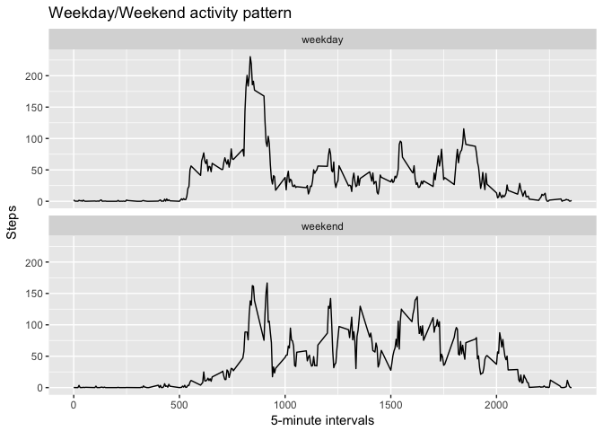

## Loading and preprocessing the data
We download the data from the source, unzip it and read the activity.csv file: 

```r
exdata <- "https://d396qusza40orc.cloudfront.net/repdata%2Fdata%2Factivity.zip"
download.file(exdata, destfile = "./exdata.zip", method = "curl")
unzip("exdata.zip")
activity <- read.table("activity.csv", header = TRUE, sep = ",")
```

The activity dataframe has the following characteristics:

```r
str(activity)
```

```
## 'data.frame':	17568 obs. of  3 variables:
##  $ steps   : int  NA NA NA NA NA NA NA NA NA NA ...
##  $ date    : Factor w/ 61 levels "2012-10-01","2012-10-02",..: 1 1 1 1 1 1 1 1 1 1 ...
##  $ interval: int  0 5 10 15 20 25 30 35 40 45 ...
```

## What is mean total number of steps taken per day?
We first calculate the total number of steps taken per day and store it in a new df

```r
totalsteps<- aggregate(activity$steps, by=list(activity$date), FUN= sum)
names(totalsteps)<- c("Date", "Steps")
```

The new df looks like this:

```r
head(totalsteps,3)
```

```
##         Date Steps
## 1 2012-10-01    NA
## 2 2012-10-02   126
## 3 2012-10-03 11352
```

We now plot the histogram of the total steps per day:

```r
library(ggplot2)
ggplot(data = totalsteps, aes(Steps)) + geom_histogram(binwidth=1000) +labs(x="Total number of steps", y = "Count of days")+ ggtitle("Histogram of total number of steps")
```

<!-- -->

We also calculate the mean and median of the total number of steps taken per day, ignoring NA values:

```r
mean_steps <- mean(totalsteps$Steps, na.rm= TRUE)
print(mean_steps)
```

```
## [1] 10766.19
```


```r
median_steps <- mean(totalsteps$Steps, na.rm= TRUE)
print(median_steps)
```

```
## [1] 10766.19
```

## What is the average daily activity pattern?
We first calculate the average number of steps taken per interval and store it in a new dataframe meansteps

```r
meansteps<- aggregate(activity$steps, by=list(activity$interval), FUN= mean, na.rm= TRUE)
names(meansteps)<- c("Interval", "Steps")
```

We then make a time series plot of the 5-minute interval (x-axis) and the average number of steps taken (per interval) averaged across all days (y-axis) 

```r
ggplot(data = meansteps, aes(Interval,Steps)) + geom_line() +labs(x="5-minute intervals", y = "Steps")+ ggtitle("Daily activity pattern")
```

<!-- -->

The 5-minute interval that, on average, contains more steps is:

```r
maxint<- meansteps$Interval[which.max(meansteps$Steps)]
print(maxint)
```

```
## [1] 835
```

## Imputing missing values
We calculate the count of missing Steps values

```r
NAcount<- sum(is.na(activity$steps))
print(NAcount)
```

```
## [1] 2304
```

Create a new data frame where missing values are replaced with the means for each interval

```r
library(plyr)
impute.mean <- function(x) replace(x, is.na(x), mean(x, na.rm = TRUE))
activity_imputed<- ddply(activity, ~ interval, transform, steps = impute.mean(steps))
```


Calculate the total number of steps taken per day based on imputed data and store it in a new df

```r
totalimputedsteps<- aggregate(activity_imputed$steps, by=list(activity_imputed$date), FUN= sum)
names(totalimputedsteps)<- c("Date", "Steps")
```

Make a histogram of the imputed data


```r
ggplot(data = totalimputedsteps, aes(Steps)) + geom_histogram(binwidth=1000) +labs(x="Total number of steps", y = "Count of days")+ ggtitle("Histogram of total number of steps, imputed data")
```

<!-- -->

We calculate the mean and median of the total number of steps taken per day, with imputed values:

```r
mean_stepsimputed <- mean(totalimputedsteps$Steps, na.rm= TRUE)
print(mean_stepsimputed)
```

```
## [1] 10766.19
```


```r
median_stepsimputed <- median(totalimputedsteps$Steps, na.rm= TRUE)
print(median_stepsimputed)
```

```
## [1] 10766.19
```

## Are there differences in activity patterns between weekdays and weekends?
We create a new factor variable in the imputed dataset with two levels – “weekday” and “weekend” indicating whether a given date is a weekday or weekend day


```r
library(lubridate)
activity_imputed$wday <- wday(activity_imputed$date, label = TRUE)
activity_imputed$wday <-  ifelse(activity_imputed$wday == "Sat"| activity_imputed$wday=="Sun", "weekend", "weekday")
```

We first calculate the average number of steps taken per interval grouped by weekend or weekday and store it in a new dataframe meanimputedwdaysteps

```r
meanimputedwdaysteps<- aggregate(activity_imputed$steps, by=list(activity_imputed$interval, activity_imputed$wday), FUN= mean, na.rm= TRUE)
names(meanimputedwdaysteps)<- c("Interval", "Wday", "Steps")
```

Now we make a panel plot containing a time series plot of the 5-minute interval (x-axis) and the average number of steps taken, averaged across all weekday days or weekend days (y-axis).


```r
ggplot(data = meanimputedwdaysteps, aes(Interval,Steps)) + geom_line() +labs(x="5-minute intervals", y = "Steps")+ ggtitle("Weekday/Weekend activity pattern")+facet_wrap(~Wday,ncol = 1)
```

<!-- -->
